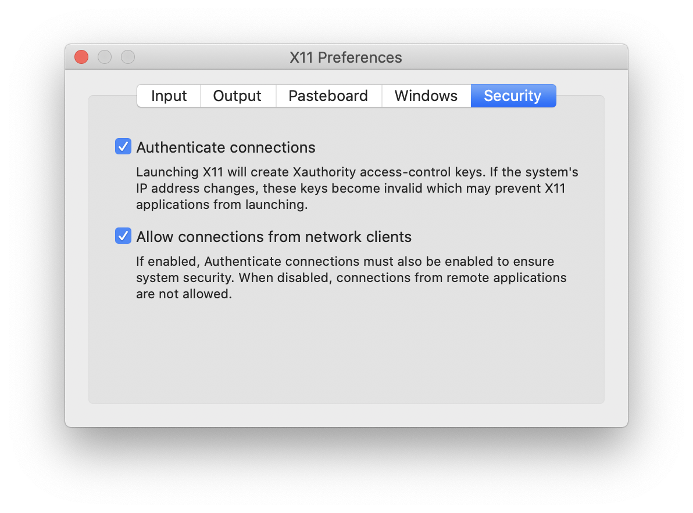

# SpineCreator
DockerFile for the complete [SpineCreator](http://spineml.github.io/spinecreator/) application stack. Downloads from source and builds when necessary:
1. [BRAHMS](https://github.com/BRAHMS-SystemML/brahms)
2. [SpineML to BRAHMS](https://github.com/SpineML/SpineML_2_BRAHMS)
3. [SpineML PreFlight](https://github.com/SpineML/SpineML_PreFlight)
4. [SpineCreator](https://github.com/SpineML/SpineCreator)

## Getting started
1. Download the Docker image with `docker pull tacd/spinecreator`
   ### macOS only
   1. Download, install, and run [xQuartz](https://www.xquartz.org)
   2. Run:
   ```
   export HOSTNAME=`hostname`
   xhost + ${HOSTNAME}
   DISPLAY=${HOSTNAME}:0
   ```
   While using `xhost +` to grant universal access to the X server is insecure, it's less of a problem on macOS since XQuartz is unlikely to be left running in the background.
   
   If SpineCreator still won't appear in step 2 below, try granting access via IP instead:
   ```
   export IP=$(ifconfig en0 | grep inet | awk '$1=="inet" {print $2}')
   xhost + ${IP}
   DISPLAY=${IP}:0
   ```
   …ensuring that XQuartz is set to allow connections from network clients:
   
   … and possibly replacing `en0` with `en1` if your local IP is obtained over Wi-Fi.
     
2. Start the Docker image with
```
docker run \
-v /tmp/.X11-unix:/tmp/.X11-unix `# Allows display of GUI` \
-v <YOUR_MODEL_DIRECTORY>:/home/docker/Models `# Allows loading of models` \
-v <YOUR_OUTPUT_DIRECTORY>:/home/docker/SpineML_2_BRAHMS/temp `# Allows access to output data` \
-v /home/docker/SpineML_2_BRAHMS `# Allows persistent storage of compiled model components` \
-e DISPLAY --name spinecreator tacd/spinecreator
```
3. After this first initialsation, you can simply run `docker restart spinecreator` to start SpineCreator again in future.

### Notes
* This assumes your local UID is 1000 (the default for a single non-root user); check by entering `id $USER` at a terminal
* If you're feeling fancy, run `cp SpineCreator.desktop ~/.local/share/applications/; cp spineml.png ~/.local/share/icons/` on Linux to create a desktop launcher for SpineCreator
